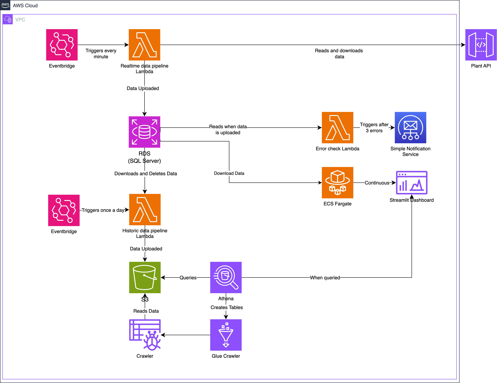

# Architecture

## Overview

The Liverpool Natural History Museum Plant Monitoring System is a cloud-native solution designed to continuously monitor the health of approximately 50 plants in the museum's conservatory. This system collects real-time sensor data, processes it for quality assurance, stores it efficiently across multiple tiers, and provides comprehensive visualisation and alerting capabilities.

## Architecture diagram

## Architecture Overview

The above solution leverages serverless AWS resources, combining real time data processing with cost effective long term storage.

The architecture is built around two main data pipelines hosted on AWS Lambda's.

### Real-time Data Pipeline
- Frequency: Every minute.
- Purpose: Continuous monitoring and immediate alerting.
- Storage: 24-hour rolling window in RDS SQL Server.

### Historical Data Pipeline
- Frequency: Daily.
- Purpose: Long-term trend analysis and reporting.
- Storage: S3 bucket with Athena querying.

## Data Flow

### Real-time Flow (Every Minute)

1. **EventBridge** triggers the real-time pipeline Lambda.
2. **Lambda** fetches data from all 50 plant sensors and puts them through an ETL pipeline.
3. **RDS SQL Server** stores validated data.
    - **Lambda** checks if updated data has any warnings.
    - **Step Function** triggered when any data has 3 critical failures.
    - **SNS** sends alerts if critical thresholds are breached.
4. **Streamlit Dashboard** displays updated information on first page.

### Historical Flow (Daily)
1. **EventBridge** triggers the historical pipeline Lambda (once daily).
2. **Lambda** an ETL pipeline which collects the day's data from SQL Server and transforms into Parquet files, loading to S3.
4. **S3** stores summarised data in Parquet format.
5. **Glue Crawler** updates the data catalogue.
6. **Athena** enables SQL queries over historical data.
7. **Streamlit Dashboard** displays historic information on a second page.
