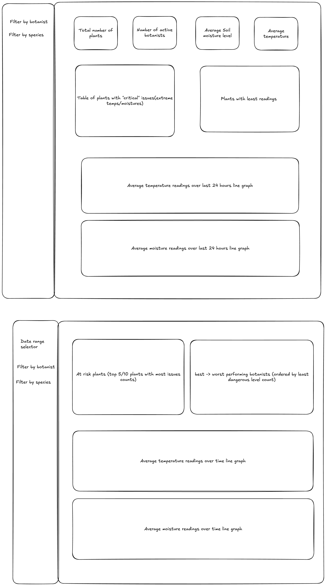

# Dashboard

This directory stores all the data regarding the dashboard. 

To see the dashboard run the command 
`streamlit run Real_Time_Data_Dashboard.py`

## Real time data page

- The dashboard shows statistics on how many plants are in the museum, how many active botanists there are, the average temperature of all the plants and the average soil moisture of all of the plants.

- The first thing you will notice is if there are any plants with critical temperatures they will be alerted to so that users of the dashboard can attend the plants in need.

- The dashboard will prompt you to select the plants you would like to view where you can use the sidebar to filter by botanist or by plants.

- You will see the plants that have had the least number of readings such that if there are any plants with a very low number of readings the sensor can be checked.

- At the bottom of the page in a drop down tab you can see the most recent readings of all of the plants.

## Historic data page

- This page will prompt you to select plants you'd like to see the history of.

- In the side bar you can decide to filter which plants you'd like to see and over what time frame. 

- The graphs for both average temperature and moisture trends are available for all plants with records stored, meaning it is accessible if plants are added in future.

