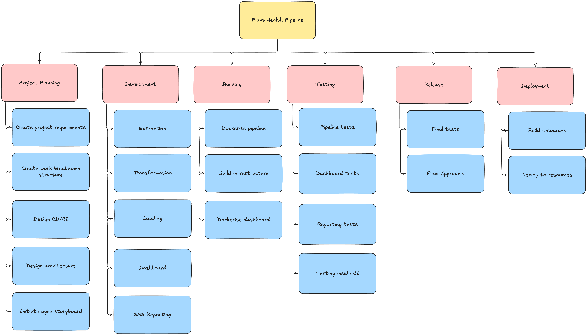

# Project Planning

Directory containing the planning documents used to drive the project.

## Work Breakdown Structure

### Top level WBS

- Shows the top level work packages for the project
- Used to develop tickets in the storyboard
- Used as an overarching project plan